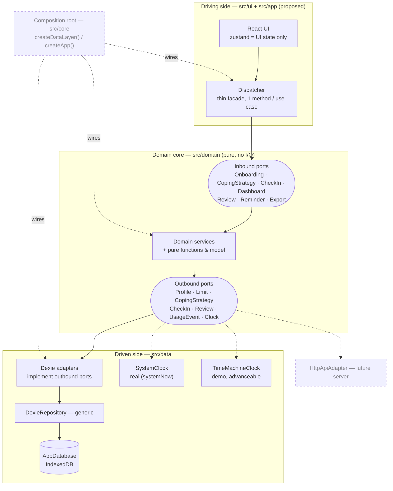
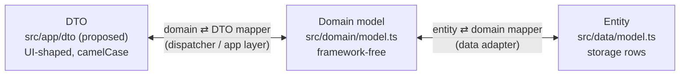

# Architecture — Hexagonal (Ports & Adapters)

**Port state:** 📝 `DRAFT` (designed only) · 🚧 `IN PROGRESS` (partially built) · 🔍 `REVIEW` (built, under review) · ✅ `DONE` (built & tested).

Every port lists its contract as **Method · Accepts · Returns · Description**, where
Accepts/Returns name a definition shown as JSON below the table (`—` = nothing, `?` =
nullable, `[]` = array). Inbound services speak camelCase DTOs; outbound repositories
speak the camelCase domain model and map it to the snake_case rows they store.

## Layers & flow

The hexagon end to end: the UI drives the domain through inbound ports; the domain
reaches storage through outbound ports that data adapters implement. Calls flow outward,
dependencies point inward.



## Model seams — DTO ⟷ Domain ⟷ Entity

One model shape per boundary with a mapper at each seam. The domain model is
camelCase; the storage entity keeps the brief's snake_case column names, so the
entity ⇄ domain mapper (`src/data/mappers.ts`) does a real field rename.



## Inbound ports (driving)

Use-case entry points the UI calls through the dispatcher; each is implemented by a
domain service. **Depends on** lists the ports the service needs, split into inbound and
outbound sub-lists.

### OnboardingService

**Status:** ✅ DONE — `getSuggestedLimits` + `complete` + `getStatus` implemented as `OnboardingServiceImpl` (`src/app/services/onboardingServiceImpl.ts`), tested (`tests/jest/app/onboardingService.test.ts`), wired via `createApp()` and consumed by the UI onboarding flow (`src/ui/onboarding/OnboardingFlow.tsx`). `getStatus` is what `src/ui/App.tsx` calls on mount to decide whether to show the onboarding wizard or skip straight to the dashboard — a returning demo user (or seeded data) never re-runs onboarding.

**Depends on**
- Inbound
  - (none)
- Outbound
  - OnboardingRepository — the atomic profile + week-1 limit + coping write the built `completeOnboarding` use case relies on (stands in for the separate Profile/Limit/CopingStrategy repos)
  - ProfileRepository — read-only lookup for `getStatus` (`OnboardingRepository` is write-only)
  - Clock (`now` + `TodayClock`, injected at the composition root)

| Method             | Accepts                    | Returns                     | Description                                                  |
|--------------------|----------------------------|------------------------------|--------------------------------------------------------------|
| getStatus          | `—`                         | `OnboardingStatusResponse`  | Whether the demo user has already completed onboarding       |
| getSuggestedLimits | `ReferenceWeekRequest`     | `SuggestedLimitsResponse`   | 80% suggestion + 90% ceiling from the reference week         |
| complete           | `OnboardingProfileRequest` | `OnboardingProfileResponse` | Finalize onboarding: persist profile + week-1 limit + coping |

**OnboardingStatusResponse**

```json
{
  "completed": true
}
```

**ReferenceWeekRequest**

```json
{
  "timeMinutes": 600,
  "stakesAmount": 10000
}
```

**SuggestedLimitsResponse**

```json
{
  "timeMinutes": 480,
  "stakesAmount": 8000,
  "timePercent": 80,
  "stakePercent": 80,
  "timeCapMinutes": 540,
  "stakesCapAmount": 9000,
  "capPercent": 90
}
```

**OnboardingProfileRequest**

```json
{
  "reference": {
    "timeMinutes": 600,
    "stakesAmount": 10000
  },
  "limits": {
    "timeMinutes": 480,
    "stakesAmount": 8000
  },
  "coping": [
    {
      "label": "Na chvíli změním prostředí",
      "type": "default"
    }
  ]
}
```

**OnboardingProfileResponse**

```json
{
  "reference": {
    "timeMinutes": 600,
    "stakesAmount": 10000
  },
  "limits": {
    "timeMinutes": 480,
    "stakesAmount": 8000
  },
  "coping": [
    {
      "label": "Na chvíli změním prostředí",
      "type": "default"
    }
  ],
  "interventionStartDate": "2026-09-01T00:00:00.000Z"
}
```

Wired end to end — the reference example for the whole hexagon:


### CopingStrategyService

**Status:** ✅ DONE — `getSuggestions` implemented as `CopingStrategyServiceImpl` (`src/app/services/copingStrategyServiceImpl.ts`), tested (`tests/jest/app/copingStrategyService.test.ts`), wired via `createApp()` and consumed by the onboarding coping picker (`src/ui/onboarding/steps/CopingStep.tsx`). Post-onboarding management (create/toggle/list) can be surfaced here as those screens land.

**Depends on**
- Inbound
  - (none)
- Outbound
  - CopingStrategyRepository

| Method         | Accepts | Returns                | Description                                             |
|----------------|---------|------------------------|---------------------------------------------------------|
| getSuggestions | `—`     | `CopingSuggestionDto[]` | Predefined coping suggestions for the onboarding picker |

**CopingSuggestionDto**

```json
{
  "id": "change_environment",
  "label": "Na chvíli změním prostředí"
}
```

### CheckInService

**Status:** 📝 DRAFT — `src/domain/checkin.ts` has types/signatures only (`ValidateCheckIn`, `SubmitCheckIn`, `DayStateOf`, `IsBackfill`); no implementations yet. (Its outbound repos are further along — see `CheckInRepository`/`CheckInEditRepository` below.)

**Depends on**
- Inbound
  - (none)
- Outbound
  - CheckInRepository
  - LimitRepository
  - Clock

| Method | Accepts | Returns | Description |
|---|---|---|---|
| submitCheckIn | `CheckInRequest` | `CheckInResultResponse` | Record a day's check-in |
| editCheckIn | `CheckInRequest` | `CheckInResultResponse` | Edit an existing check-in (sets `updatedAt`) |

**CheckInRequest**

```json
{
  "behaviorDate": "2026-09-03T00:00:00.000Z",
  "played": true,
  "timeMinutes": 60,
  "stakesAmount": 500,
  "winningsAmount": 0
}
```

**CheckInResultResponse**

```json
{
  "behaviorDate": "2026-09-03T00:00:00.000Z",
  "status": "POZOR",
  "remainingTimeMinutes": 130,
  "remainingStakesAmount": 1500,
  "copingReminder": "Jít na 15 minut ven"
}
```

### DashboardService

**Status:** ✅ DONE (dashboard read path) — `buildDashboardVM()` builds the current week's 7-day `DashboardVM` (`src/domain/dashboard.ts`, tested in `tests/jest/domain/dashboard.test.ts`), built on `buildDayCell()` (one day → `DayCell`, reused for both the 7-cell week strip and, later, a 28-cell month/final-summary view), `dayStateOf`/`isBackfill` (`checkin.ts`), `classifyStatus`/`worseStatus` (`limits.ts`), and `resolvePendingAction` (`guards.ts`). The inbound-port wrapper (`DashboardServiceImpl`, `src/app/services/dashboardServiceImpl.ts`) and its DTO mapper (`src/app/mappers/dashboardMapper.ts`) are built and tested (`tests/jest/app/dashboardService.test.ts`), wired via `createApp()`, and consumed by `src/ui/dashboard/Dashboard.tsx` — the screen the UI lands on once onboarding is complete. Not yet wired: `reviewable_weeks` is hardcoded empty until `ReviewRepository`/`ReviewService` exist (TODO #4/#7 below); `ReviewRepository` is injected into `DashboardServiceImpl` for that future wiring but unused today.

**Depends on**
- Inbound
  - (none)
- Outbound
  - ProfileRepository
  - LimitRepository
  - CheckInRepository
  - ReviewRepository
  - Clock

| Method | Accepts | Returns | Description |
|---|---|---|---|
| getDashboard | `—` | `DashboardResponse` | Cumulative weekly evaluation vs both limits, missing days surfaced |

**DashboardResponse**

```json
{
  "studyDay": 3,
  "weekNo": 1,
  "time": {
    "used": 350,
    "limit": 480,
    "percent": 73,
    "remaining": 130,
    "status": "OK"
  },
  "stakes": {
    "used": 6500,
    "limit": 8000,
    "percent": 81,
    "remaining": 1500,
    "status": "POZOR"
  },
  "overallStatus": "POZOR",
  "days": [
    {
      "studyDay": 1,
      "date": "2026-09-01",
      "state": "completed",
      "played": true,
      "timeMinutes": 60,
      "stakesAmount": 500
    },
    {
      "studyDay": 2,
      "date": "2026-09-02",
      "state": "missing"
    }
  ],
  "missingDays": [
    "2026-09-02"
  ],
  "pendingAction": "checkin_due"
}
```

`days` is always exactly 7 entries — the current week's strip, study-day order. Mirrors
the domain's `DayCell` (`src/domain/dashboard.ts`): `played`/`timeMinutes`/`stakesAmount`
are present only when `state` is `completed` or `backfilled`; `state` is one of
`completed` · `backfilled` · `missing` · `future` (`DayState`, `src/domain/checkin.ts`).
`buildDayCell()` builds one cell at a time so the same shape can later drive a 28-cell
month/final-summary view, not just this 7-cell week strip. Carried by a real DTO mapper —
`src/app/mappers/dashboardMapper.ts` — camelCase per this doc's DTO convention.

### ReviewService

**Status:** 📝 DRAFT — no `review.ts`; `CanReview`/`IsWeekClosed` signatures exist in `guards.ts` but are unimplemented

**Depends on**
- Inbound
  - (none)
- Outbound
  - ProfileRepository
  - LimitRepository
  - CheckInRepository
  - ReviewRepository
  - Clock

| Method | Accepts | Returns | Description |
|---|---|---|---|
| getPendingReview | `—` | `ReviewResponse?` | The review due for a closed week, if any |
| completeReview | `CompleteReviewRequest` | `void` | Close the week and set the next week's limits |
| getFinalSummary | `—` | `FinalSummaryResponse` | Final summary after day 28 (no limit-setting) |

**ReviewResponse**

```json
{
  "weekNo": 1,
  "time": {
    "used": 350,
    "limit": 480,
    "status": "OK"
  },
  "stakes": {
    "used": 6500,
    "limit": 8000,
    "status": "POZOR"
  },
  "missingDays": [
    "2026-09-02"
  ],
  "suggestedNextLimits": {
    "timeMinutes": 480,
    "stakesAmount": 8000
  }
}
```

**CompleteReviewRequest**

```json
{
  "reviewWeekNo": 1,
  "nextLimits": {
    "timeMinutes": 460,
    "stakesAmount": 7500
  },
  "incomplete": false
}
```

**FinalSummaryResponse**

```json
{
  "weeks": [
    {
      "weekNo": 1,
      "timeStatus": "OK",
      "stakesStatus": "POZOR",
      "overall": "POZOR"
    }
  ]
}
```

### ReminderService

**Status:** 📝 DRAFT — no `reminder.ts`; `PendingAction`/`ResolvePendingAction` type exists in `guards.ts` but is unimplemented

**Depends on**
- Inbound
  - (none)
- Outbound
  - CheckInRepository
  - ProfileRepository
  - Clock

| Method | Accepts | Returns | Description |
|---|---|---|---|
| getDueReminder | `—` | `ReminderResponse?` | The one working reminder scenario, if due |

**ReminderResponse**

```json
{
  "kind": "checkin_due",
  "behaviorDate": "2026-09-02T00:00:00.000Z",
  "message": "Doplňte prosím včerejší check-in."
}
```

### ExportService

**Status:** 📝 DRAFT — no `PersonDayRow` builder / CSV row derivation logic exists yet

**Depends on**
- Inbound
  - (none)
- Outbound
  - ProfileRepository
  - LimitRepository
  - CheckInRepository
  - ReviewRepository

| Method | Accepts | Returns | Description |
|---|---|---|---|
| exportPersonDaysCsv | `—` | `string` (CSV of `PersonDayRow`) | Person-day CSV, one row per study day 1–28 |

**PersonDayRow** (one CSV line)

```json
{
  "userId": "A001",
  "interventionStartDate": "2026-09-01T00:00:00.000Z",
  "studyDay": 3,
  "weekNo": 1,
  "behaviorDate": "2026-09-03T00:00:00.000Z",
  "checkinStatus": "completed",
  "played": true,
  "timeMinutes": 60,
  "stakesAmount": 500,
  "winningsAmount": 0,
  "submittedAt": "2026-09-04T08:00:00+02:00",
  "updatedAt": null,
  "isBackfill": false
}
```

## Outbound ports (driven)

Storage contracts the domain depends on, each implemented by a data-layer adapter (and,
later, an HTTP adapter). The port signatures accept/return the **camelCase domain model**
(`src/domain/model.ts`); the JSON blocks below show the **snake_case storage entity**
(`src/data/model.ts`) the adapter maps that model to — so `Profile.userId` is stored as
`user_id`, and so on.

### ProfileRepository

**Status:** ✅ DONE · adapter: `ProfileAdapter`

| Method | Accepts | Returns | Description |
|---|---|---|---|
| save | `Profile` | `void` | Insert or replace the profile |
| get | `UserId` | `Profile?` | Read the profile by user |

**Profile**

```json
{
  "user_id": "A001",
  "onboarding_completed_at": "2026-08-31T21:30:00+02:00",
  "intervention_start_date": "2026-09-01T00:00:00.000Z",
  "reference_time_min": 600,
  "reference_stakes_czk": 10000
}
```

### LimitRepository

**Status:** ✅ DONE · adapter: `LimitAdapter`

| Method | Accepts | Returns | Description |
|---|---|---|---|
| save | `Limit` | `void` | Append a weekly limit (one per week, never overwritten) |
| listByUser | `UserId` | `Limit[]` | All limits for a user, by week |

**Limit**

```json
{
  "limit_id": "3f2b…",
  "user_id": "A001",
  "week_no": 1,
  "weekly_limit_time_min": 480,
  "weekly_limit_stakes_czk": 8000,
  "limit_set_at": "2026-09-01T08:00:00+02:00"
}
```

### CopingStrategyRepository

**Status:** ✅ DONE · adapter: `CopingStrategyAdapter`

| Method | Accepts | Returns | Description |
|---|---|---|---|
| loadDefaults | `—` | `CopingStrategyDefault[]` | Predefined suggestions for the onboarding picker |
| create | `CopingStrategyInput` | `CopingStrategy` | Write a custom or adopted strategy |
| setActive | `copingStrategyId, active` | `void` | Toggle a strategy active/inactive |
| listByUser | `UserId` | `CopingStrategy[]` | The user's strategies, by priority |

**CopingStrategyInput**

```json
{
  "user_id": "A001",
  "label": "Zavolat bratrovi",
  "type": "custom",
  "priority": 2,
  "active": true
}
```

**CopingStrategy**

```json
{
  "coping_strategy_id": "9a1c…",
  "user_id": "A001",
  "label": "Na chvíli změním prostředí",
  "type": "default",
  "priority": 1,
  "active": true,
  "created_at": "2026-08-31T21:30:00+02:00",
  "updated_at": null
}
```

**CopingStrategyDefault** (from the seed catalog, `src/data/seeds/copingDefaults.ts`)

```json
{
  "code": "change_environment",
  "label": "Na chvíli změním prostředí",
  "priority": 1,
  "reminder_text": "Vytvořím si krátký odstup od místa nebo zařízení spojeného s hraním."
}
```

### CheckInRepository

**Status:** ✅ DONE · adapter: `CheckInAdapter` — tested (`tests/jest/data/checkin-adapters.test.ts`)

| Method | Description |
|---|---|
| save | Insert or replace a check-in, keyed on (user, behavior_date) |
| get | One check-in by id |
| listByUser | All check-ins for a user, ordered by `behavior_date` |

Note: method names above have drifted from the original draft (`upsert`/`getByDate`/`listByWeek`) — this reflects what's actually implemented today.

The port speaks the camelCase domain `CheckIn` (`src/domain/model.ts`); the row it stores is the snake_case `CheckInEntity` (`src/data/model.ts`) shown here:

**CheckIn** (storage entity)

```json
{
  "check_in_id": "b7e0…",
  "user_id": "A001",
  "behavior_date": "2026-09-03T00:00:00.000Z",
  "week_no": 1,
  "played": true,
  "time_min": 60,
  "stakes_czk": 500,
  "winnings_czk": 0,
  "submitted_at": "2026-09-04T08:00:00+02:00",
  "updated_at": null
}
```

### CheckInEditRepository

**Status:** ✅ DONE · adapter: `CheckInEditAdapter` — tested (`tests/jest/data/checkin-adapters.test.ts`)

Not in the original port list — added alongside `CheckInRepository` to log check-in edits (`CheckInEdit`: create/update, before/after snapshots, changed fields).

| Method | Description |
|---|---|
| save | Append an edit-log row |
| get | One edit-log row by id |
| listByCheckIn | A check-in's edit history, oldest first |

### ContactRepository

**Status:** ✅ DONE · adapter: `ContactAdapter` — tested (`tests/jest/data/contactAdapter.test.ts`)

Not in the original port list — supports a counselling/emergency contacts list (`Contact` model: category, phone, url, availability, priority).

| Method | Description |
|---|---|
| seed | Idempotent seed from `CONTACTS`, safe on every boot |
| list | All contacts, by priority |
| get | One contact by id |

The port speaks the camelCase domain `Contact` (`src/domain/model.ts`); the row it stores is the snake_case `ContactEntity` (`src/data/model.ts`) shown here:

**Contact** (storage entity)

```json
{
  "contact_id": "d5f3…",
  "name": "Linka pro problémové hráče",
  "purpose": "Anonymní poradenství",
  "phone": "+420 xxx xxx xxx",
  "url": null,
  "availability": "Po–Pá 8–20",
  "category": "counselling",
  "priority": 1
}
```

### ReviewRepository

**Status:** 📝 DRAFT · adapter: `ReviewAdapter`

| Method | Accepts | Returns | Description |
|---|---|---|---|
| save | `Review` | `void` | Append a review (one per week) |
| getByWeek | `UserId, weekNo` | `Review?` | A week's review |
| listByUser | `UserId` | `Review[]` | All reviews for a user |

**Review**

```json
{
  "review_id": "c4d9…",
  "user_id": "A001",
  "review_week_no": 1,
  "review_completed_at": "2026-09-08T09:00:00+02:00",
  "limit_changed": true,
  "incomplete": false
}
```

### UsageEventRepository

**Status:** 📝 DRAFT · adapter: `UsageEventAdapter`

| Method | Accepts | Returns | Description |
|---|---|---|---|
| append | `UsageEvent` | `void` | Add an interaction event |
| listByUser | `UserId` | `UsageEvent[]` | All events for a user |

**UsageEvent**

```json
{
  "usage_event_id": "e12a…",
  "user_id": "A001",
  "event_type": "app_opened",
  "occurred_at": "2026-09-04T08:00:00+02:00",
  "screen": "dashboard",
  "detail": null
}
```

### Clock

**Status:** 🚧 IN PROGRESS · adapters: `SystemClock` (real, ✅ DONE), `TimeMachineClock` (demo, 📝 DRAFT)

| Method | Accepts | Returns | Description |
|---|---|---|---|
| now | `—` | `ISOTimestamp` (string) | Current instant as an ISO 8601 timestamp |

Both implement the `Clock` port (`now()`); the composition root picks which one —
`SystemClock` in production, `TimeMachineClock` for the demo and tests. The domain only
ever sees `now()`; any extra controls stay outside the port.

**SystemClock** — ✅ DONE · `src/data/clock.ts`

Returns real wall-clock time as an ISO 8601 string (`systemNow`). Stateless, no controls.
The default everywhere except the demo and tests.

**TimeMachineClock** — 📝 DRAFT · proposed `src/data/timeMachineClock.ts`

Holds a virtual "now" that the demo can move, so the jury can walk days 1–28 — missing
day, backfill, weekly review, final summary — without waiting for real time. It honours
the same `now()` contract; its controls below are exposed to a demo drawer / test helper,
never called by the domain.

| Control | Effect |
|---|---|
| setNow(iso) | Pin the virtual clock to a specific instant |
| advanceDays(n) | Jump forward n calendar days |
| reset | Return to real time (or the seeded start date) |

## TODO — domain

Everything downstream of onboarding is still unimplemented in `src/domain`. In priority order (each blocks a "must work" jury flow):

1. **CheckInService** (`checkin.ts`) — `dayStateOf`/`isBackfill` are now implemented (pulled forward as a `DashboardService` dependency); `validateCheckIn`/`submitCheckIn` still need implementing against the existing type signatures. Its outbound repos (`CheckInRepository`, `CheckInEditRepository`) are already built, so this is the next unblocked piece.
2. **DashboardService** (`dashboard.ts`) — ✅ `buildDashboardVM` builds the current week's `DashboardVM` from check-ins + limit history (never stored, per CLAUDE.md), and ✅ `DashboardServiceImpl` wraps it as the inbound port, consumed by `src/ui/dashboard/Dashboard.tsx`. Remaining: wire `reviewable_weeks` once `ReviewRepository` exists (#4/#7).
3. **guards.ts implementations** — `evaluateLimitAdjustment` and `resolvePendingAction` are built. Still missing: `canEditCheckIn`, `isWeekClosed`, `canReview`. These block both `CheckInService` (edit window) and `ReviewService` (week-closing).
4. **ReviewService** (new `review.ts`) — `getPendingReview`, `completeReview`, `getFinalSummary`; depends on guards #3 and a `ReviewRepository` adapter (currently 📝 DRAFT, no adapter yet).
5. **ReminderService** (new `reminder.ts`) — `getDueReminder`; depends on `resolvePendingAction` from guards #3.
6. **ExportService** (new `export.ts`) — `PersonDayRow` builder for the CSV export; depends on #1–#2 for source data, and must respect the missing-vs-no-play blank/zero distinction (CLAUDE.md CSV gotcha).
7. **Outbound gaps**: `ReviewRepository` and `UsageEventRepository` have no adapters yet (`src/data/adapters` has no `reviewAdapter.ts`/`usageEventAdapter.ts`); `TimeMachineClock` (the demo/jury clock) is still 📝 DRAFT — needed before any 28-day walkthrough can be demoed without waiting real days.
