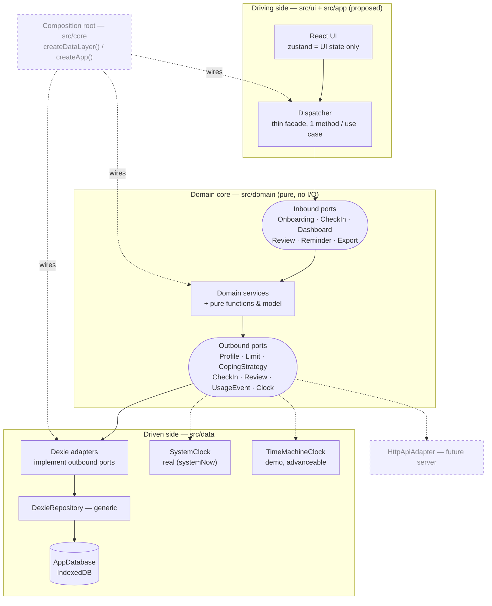
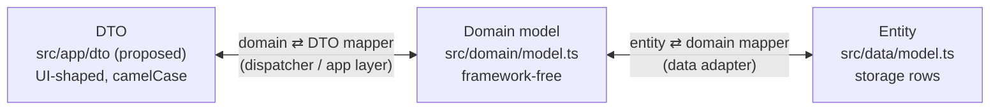
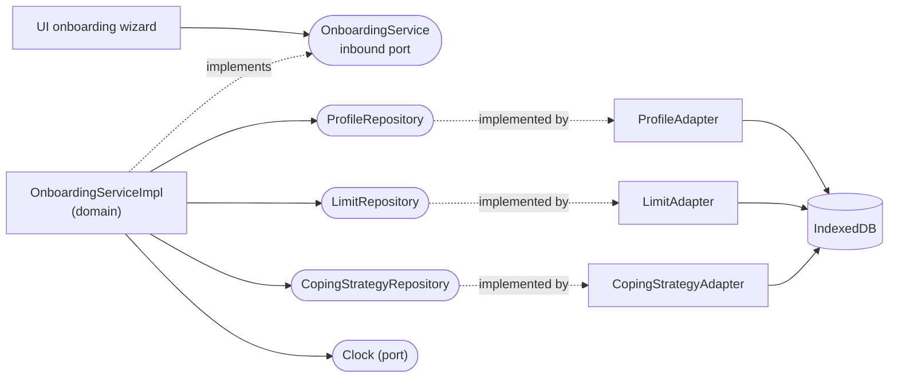

# Architecture — Hexagonal (Ports & Adapters)

**Port state:** 📝 `DRAFT` (designed only) · 🚧 `IN PROGRESS` (partially built) · 🔍 `REVIEW` (built, under review) · ✅ `DONE` (built & tested).

## Layers & flow

The hexagon end to end: the UI drives the domain through inbound ports; the domain
reaches storage through outbound ports that data adapters implement. Calls flow outward,
dependencies point inward.



## Model seams — DTO ⟷ Domain ⟷ Entity

One model shape per boundary with a mapper at each seam — identical today, free to
diverge later without touching the core.



## Inbound ports (driving)

Use-case entry points the UI calls through the dispatcher; each is implemented by a
domain service. **Depends on** lists the ports the service needs, tagged by side.

### OnboardingService

**Status:** 📝 DRAFT

**Depends on**
- ProfileRepository — outbound
- LimitRepository — outbound
- CopingStrategyRepository — outbound
- Clock — outbound

| Method | Description                                                                                                |
|---|------------------------------------------------------------------------------------------------------------|
| setRefernce | Sends `ReferenceWeekRequest`                                                                               |
| getSuggestedLimits | Returns a `SuggestedLimitsResponse` (suggested time + money limits) from the reference week                |
| complete | Sends `OnboardingProfileRequest`. Finalizes onboarding: persists profile + week-1 limit + coping, returns `OnboardingProfileResponse` |

DTOs — in: `ReferenceWeek`, `OnboardingCommand` · out: `SuggestedLimits`

**ReferenceWeekRequest**
```json
{ 
  "timeMinutes": 600, 
  "stakesAmount": 10000
}
```

**SuggestedLimitsResponse**
```json
{ 
  "timeMinutes": 480, 
  "stakesAmount": 8000, 
  "timePercent": 80, 
  "stakePercent": 80
}
```

**OnboardingProfileRequest**
```json
{
  "reference": { 
    "timeMinutes": 600, 
    "stakesAmount": 10000
  },
  "limits": { 
    "timeMinutes": 480, 
    "stakesAmount": 8000
  },
  "coping": [
    {
      "label": "Jít na 15 minut ven",
      "type": "default"
    }
  ]
}
```

**OnboardingProfileResponse**
```json
{
  "reference": { 
    "timeMinutes": 600, 
    "stakesAmount": 10000
  },
  "limits": { 
    "timeMinutes": 480, 
    "stakesAmount": 8000
  },
  "coping": [
    {
      "label": "Jít na 15 minut ven",
      "type": "default"
    }
  ],
  "interventionStartDate": "yyyy-mm-dd" 
}
```

Wired end to end — the reference example for the whole hexagon:



### CheckInService

**Status:** 📝 DRAFT

**Depends on**
- CheckInRepository — outbound
- LimitRepository — outbound
- Clock — outbound

| Method | Description |
|---|---|
| submitCheckIn | Record a day's check-in |
| editCheckIn | Edit an existing check-in (sets `updated_at`) |

DTOs — in: `SubmitCheckInCommand`, `EditCheckInCommand` · out: `CheckInResult`

```json
{
  "SubmitCheckInCommand": {
    "user_id": "A001",
    "behavior_date": "2026-09-03",
    "played": true,
    "time_min": 60,
    "stakes_czk": 500,
    "winnings_czk": 0
  },
  "EditCheckInCommand": {
    "user_id": "A001",
    "behavior_date": "2026-09-03",
    "played": true,
    "time_min": 45,
    "stakes_czk": 400,
    "winnings_czk": 0
  },
  "CheckInResult": {
    "behavior_date": "2026-09-03",
    "status": "POZOR",
    "remaining_time_min": 130,
    "remaining_stakes_czk": 1500,
    "coping_reminder": "Jít na 15 minut ven"
  }
}
```

### DashboardService

**Status:** 📝 DRAFT

**Depends on**
- ProfileRepository — outbound
- LimitRepository — outbound
- CheckInRepository — outbound
- ReviewRepository — outbound
- Clock — outbound

| Method | Description |
|---|---|
| getDashboard | Cumulative weekly evaluation vs both limits, missing days surfaced |

DTOs — out: `DashboardView`

```json
{
  "DashboardView": {
    "study_day": 3,
    "week_no": 1,
    "time": { "used": 350, "limit": 480, "pct": 73, "remaining": 130, "status": "OK" },
    "stakes": { "used": 6500, "limit": 8000, "pct": 81, "remaining": 1500, "status": "POZOR" },
    "overall_status": "POZOR",
    "missing_days": ["2026-09-02"],
    "pending_action": "checkin_due"
  }
}
```

### ReviewService

**Status:** 📝 DRAFT

**Depends on**
- ProfileRepository — outbound
- LimitRepository — outbound
- CheckInRepository — outbound
- ReviewRepository — outbound
- Clock — outbound

| Method | Description |
|---|---|
| getPendingReview | The review due for a closed week, if any |
| completeReview | Close the week and set the next week's limits |
| getFinalSummary | Final summary after day 28 (no limit-setting) |

DTOs — in: `CompleteReviewCommand` · out: `ReviewView`, `FinalSummaryView`

```json
{
  "ReviewView": {
    "week_no": 1,
    "time": { "used": 350, "limit": 480, "status": "OK" },
    "stakes": { "used": 6500, "limit": 8000, "status": "POZOR" },
    "missing_days": ["2026-09-02"],
    "suggested_next_limits": { "time_min": 480, "stakes_czk": 8000 }
  },
  "CompleteReviewCommand": {
    "user_id": "A001",
    "review_week_no": 1,
    "next_limits": { "time_min": 460, "stakes_czk": 7500 },
    "incomplete": false
  },
  "FinalSummaryView": {
    "weeks": [{ "week_no": 1, "time_status": "OK", "stakes_status": "POZOR", "overall": "POZOR" }]
  }
}
```

### ReminderService

**Status:** 📝 DRAFT

**Depends on**
- CheckInRepository — outbound
- ProfileRepository — outbound
- Clock — outbound

| Method | Description |
|---|---|
| getDueReminder | The one working reminder scenario, if due |

DTOs — out: `ReminderView`

```json
{
  "ReminderView": {
    "kind": "checkin_due",
    "behavior_date": "2026-09-02",
    "message": "Doplňte prosím včerejší check-in."
  }
}
```

### ExportService

**Status:** 📝 DRAFT

**Depends on**
- ProfileRepository — outbound
- LimitRepository — outbound
- CheckInRepository — outbound
- ReviewRepository — outbound

| Method | Description |
|---|---|
| exportPersonDaysCsv | Person-day CSV, one row per study day 1–28 |

DTOs — out: `PersonDayRow` (one CSV line)

```json
{
  "PersonDayRow": {
    "user_id": "A001",
    "intervention_start_date": "2026-09-01",
    "study_day": 3,
    "week_no": 1,
    "behavior_date": "2026-09-03",
    "checkin_status": "completed",
    "played": true,
    "time_min": 60,
    "stakes_czk": 500,
    "winnings_czk": 0,
    "submitted_at": "2026-09-04T08:00:00+02:00",
    "updated_at": null,
    "is_backfill": false
  }
}
```

## Outbound ports (driven)

Storage contracts the domain depends on, each implemented by a data-layer adapter (and,
later, an HTTP adapter).

### ProfileRepository

**Status:** ✅ DONE · adapter: `ProfileAdapter`

| Method | Description |
|---|---|
| save | Insert or replace the profile |
| get | Read the profile by user |

### LimitRepository

**Status:** ✅ DONE · adapter: `LimitAdapter`

| Method | Description |
|---|---|
| save | Append a weekly limit (one per week, never overwritten) |
| listByUser | All limits for a user, by week |

### CopingStrategyRepository

**Status:** ✅ DONE · adapter: `CopingStrategyAdapter`

| Method | Description |
|---|---|
| loadDefaults | Predefined suggestions for the onboarding picker |
| create | Write a custom or adopted strategy |
| setActive | Toggle a strategy active/inactive |
| listByUser | The user's strategies, by priority |

### CheckInRepository

**Status:** 📝 DRAFT · adapter: `CheckInAdapter`

| Method | Description |
|---|---|
| upsert | Insert or replace, keyed on (user, behavior_date) |
| getByDate | One day's check-in |
| listByUser | All check-ins for a user |
| listByWeek | Check-ins for a given study week |

### ReviewRepository

**Status:** 📝 DRAFT · adapter: `ReviewAdapter`

| Method | Description |
|---|---|
| save | Append a review (one per week) |
| getByWeek | A week's review |
| listByUser | All reviews for a user |

### UsageEventRepository

**Status:** 📝 DRAFT · adapter: `UsageEventAdapter`

| Method | Description |
|---|---|
| append | Add an interaction event |
| listByUser | All events for a user |

### Clock

**Status:** 🚧 IN PROGRESS · adapters: `SystemClock` (real, ✅ DONE), `TimeMachineClock` (demo, 📝 DRAFT)

| Method | Description |
|---|---|
| now | Current instant as an ISO 8601 timestamp |

- **SystemClock** — real wall-clock time (`systemNow`), for production.
- **TimeMachineClock** — demo/dev clock that can be advanced, so the jury can walk
  days 1–28 (missing day, backfill, weekly review, final summary) without waiting.
