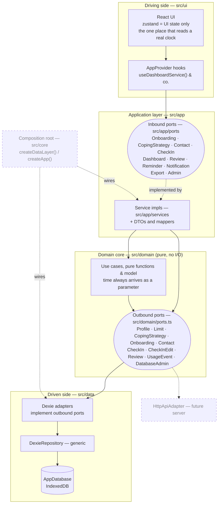
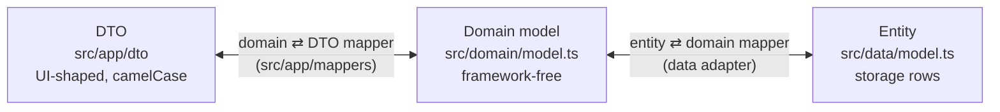
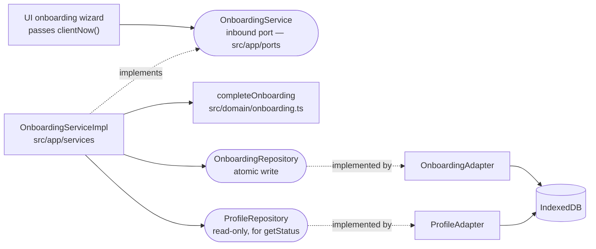

# Architecture — Hexagonal (Ports & Adapters)

**Port state:** 📝 `DRAFT` (designed only) · 🚧 `IN PROGRESS` (partially built) · 🔍 `REVIEW` (built, under review) · ✅ `DONE` (built & tested).

Every port lists its contract as **Method · Accepts · Returns · Description**, where
Accepts/Returns name a definition shown as JSON below the table (`—` = nothing, `?` =
nullable, `[]` = array). Inbound services speak camelCase DTOs; outbound repositories
speak the camelCase domain model and map it to the snake_case rows they store.

## Layers & flow

The hexagon end to end: the UI drives the domain through inbound ports; the domain
reaches storage through outbound ports that data adapters implement. Calls flow outward,
dependencies point inward.



Two things the diagram is deliberately explicit about, because both have been drawn
wrong before:

- **Inbound ports live in `src/app`, not in the domain.** `src/domain` holds the use
  cases, the model and the *outbound* contracts; the service impls that satisfy the
  inbound ports sit one ring out, in `src/app/services`, and are free to touch DTOs.
- **There is no clock adapter and no dispatcher.** Time enters as a method parameter
  (see §Clock — removed), and the UI reaches the inbound ports through the
  `AppProvider` hooks — there is no facade object in between.

## Model seams — DTO ⟷ Domain ⟷ Entity

One model shape per boundary with a mapper at each seam. The domain model is
camelCase; the storage entity keeps the brief's snake_case column names, so the
entity ⇄ domain mapper (`src/data/mappers.ts`) does a real field rename.



## Inbound ports (driving)

Use-case entry points the UI calls through the `AppProvider` hooks. Each port is declared
in `src/app/ports` and implemented by a service in `src/app/services`, which delegates the
actual rules to `src/domain`. **Depends on** lists the ports the service needs, split into
inbound and outbound sub-lists.

### OnboardingService

**Status:** ✅ DONE — `getSuggestedLimits` + `complete` + `getStatus` implemented as `OnboardingServiceImpl` (`src/app/services/onboardingServiceImpl.ts`), tested (`tests/jest/app/onboardingService.test.ts`), wired via `createApp()` and consumed by the UI onboarding flow (`src/ui/onboarding/OnboardingFlow.tsx`). `getStatus` is what `src/ui/App.tsx` calls on mount to decide whether to show the onboarding wizard or skip straight to the dashboard — a returning demo user (or seeded data) never re-runs onboarding.

**Depends on**
- Inbound
  - (none)
- Outbound
  - OnboardingRepository — the atomic profile + week-1 limit + coping write the built `completeOnboarding` use case relies on (stands in for the separate Profile/Limit/CopingStrategy repos)
  - ProfileRepository — read-only lookup for `getStatus` (`OnboardingRepository` is write-only)

No clock: `complete` takes the instant as a parameter and derives day 1 from it with
`dateOf`/`calendarTimestamp` (`src/domain/clock.ts`). **Day 1 is the calendar day
onboarding is completed**, not the day after — a deliberate deviation from the brief,
recorded in [decisions.md](decisions.md).

| Method             | Accepts                    | Returns                     | Description                                                  |
|--------------------|----------------------------|------------------------------|--------------------------------------------------------------|
| getStatus          | `—`                         | `OnboardingStatusResponse`  | Whether the demo user has already completed onboarding       |
| getSuggestedLimits | `ReferenceWeekRequest`     | `SuggestedLimitsResponse`   | 80% suggestion + 90% ceiling from the reference week         |
| complete           | `OnboardingProfileRequest` | `OnboardingProfileResponse` | Finalize onboarding: persist profile + week-1 limit + coping |

**OnboardingStatusResponse**

```json
{
  "completed": true
}
```

**ReferenceWeekRequest**

```json
{
  "timeMinutes": 600,
  "stakesAmount": 10000
}
```

**SuggestedLimitsResponse**

```json
{
  "timeMinutes": 480,
  "stakesAmount": 8000,
  "timePercent": 80,
  "stakePercent": 80,
  "timeCapMinutes": 540,
  "stakesCapAmount": 9000,
  "capPercent": 90
}
```

**OnboardingProfileRequest**

```json
{
  "reference": {
    "timeMinutes": 600,
    "stakesAmount": 10000
  },
  "limits": {
    "timeMinutes": 480,
    "stakesAmount": 8000
  },
  "coping": [
    {
      "label": "Na chvíli změním prostředí",
      "type": "default"
    }
  ]
}
```

**OnboardingProfileResponse**

```json
{
  "reference": {
    "timeMinutes": 600,
    "stakesAmount": 10000
  },
  "limits": {
    "timeMinutes": 480,
    "stakesAmount": 8000
  },
  "coping": [
    {
      "label": "Na chvíli změním prostředí",
      "type": "default"
    }
  ],
  "interventionStartDate": "2026-09-01T00:00:00.000Z"
}
```

Wired end to end — the reference example for the whole hexagon:



### CopingStrategyService

**Status:** ✅ DONE — `getSuggestions` implemented as `CopingStrategyServiceImpl` (`src/app/services/copingStrategyServiceImpl.ts`), tested (`tests/jest/app/copingStrategyService.test.ts`), wired via `createApp()` and consumed by the onboarding coping picker (`src/ui/onboarding/steps/CopingStep.tsx`). Post-onboarding management (`list`/`create`/`toggle`/`update`/`remove`) is built the same way — a thin DTO/repo wrapper over the already-DONE `CopingStrategyRepository`, validation delegated to pure domain helpers (`normalizeCopingLabel`, `normalizeCopingDetail`, `nextCopingPriority` in `src/domain/coping.ts`, tested in `tests/jest/domain/coping.test.ts`) — and now has a screen: the bottom-nav "coping" tab (`nav.tabs.coping`) opens `CopingFlow`/`CopingScreen` (`src/ui/coping/`), a toggle/add/edit/delete list that re-fetches from `list()` after every `toggle()`/`create()`/`update()`/`remove()` rather than reconciling an optimistic copy. `CopingFlow.tsx` passes `createCustomStrategyFields="full"` and wires `onCreateCustomStrategy`/`onUpdateCustomStrategy`/`onDeleteStrategy` to `create`/`update`/`remove`, so a custom strategy's title, "Kdy ji chci použít?" and "Jak začnu?" are all editable from `CustomStrategyDetailScreen.tsx`, and it can be deleted (with the built-in `DeleteStrategyDialog` confirmation) from the library's action menu; catalog (`type: 'default'`) strategies open a read-only overview (`CatalogStrategyDetailScreen.tsx`) whose copy is now sourced from `CopingStrategyDefault`/`CopingSuggestionDto` (ultimately the seed, not a hardcoded UI-layer map — see `buildCatalogStrategyDetails` in `src/ui/coping/catalogStrategyDetails.ts`), and remain undeletable — `StrategyActionDialog` only ever offers "Smazat" for `kind: 'custom'`, matching the read-only-catalog rule. `onHideStrategy` is still unwired — out of scope for the edit/delete work.

**Depends on**
- Inbound
  - (none)
- Outbound
  - CopingStrategyRepository

| Method         | Accepts | Returns                | Description                                             |
|----------------|---------|------------------------|---------------------------------------------------------|
| getSuggestions | `—`     | `CopingSuggestionDto[]` | Predefined coping suggestions for the onboarding picker |
| list           | `—`     | `CopingStrategyDto[]`  | The user's own strategies (default + custom), by priority |
| create         | `CreateCopingStrategyRequest` | `CopingStrategyDto` | Add a custom strategy, appended after the highest existing priority. Rejects an empty/whitespace-only or over-length label |
| toggle         | `copingStrategyId`, `active` | `void` | Toggle a strategy active/inactive. Rejects an unknown id (propagated from the repo, not swallowed) |
| update         | `copingStrategyId`, `UpdateCopingStrategyRequest` | `CopingStrategyDto` | Edit a custom strategy's label and/or optional detail fields (omitted keys untouched). Rejects an empty/unknown id, an over-length field, and any attempt to edit a non-custom (catalog) strategy (`COPING_NOT_EDITABLE`) |
| remove         | `copingStrategyId` | `void` | Permanently delete a custom strategy. Rejects an empty/unknown id and any attempt to delete a non-custom (catalog) strategy (`COPING_NOT_DELETABLE`) |

Every method also takes the caller-supplied `userId` (see `03c9355`) — omitted from the
table above since it's implicit context on every inbound port, not method-specific
input. Exceptions: `getSuggestions` is user-agnostic (global list, no user yet at
onboarding) and takes no `userId`; `remove` takes no `time` since nothing on a delete
is stamped.

**CopingSuggestionDto**

```json
{
  "id": "change_environment",
  "label": "Na chvíli změním prostředí"
}
```

**CopingStrategyDto**

```json
{
  "id": "9a1c…",
  "label": "Na chvíli změním prostředí",
  "type": "default",
  "active": true,
  "priority": 1,
  "whenToUse": null,
  "howToStart": null
}
```

**CreateCopingStrategyRequest**

```json
{
  "label": "Zavolat bratrovi",
  "whenToUse": "Když mám nutkání hrát",
  "howToStart": "Otevřu kontakty a zavolám"
}
```

`whenToUse`/`howToStart` are optional on create (default to `null`) and capped
at 240 characters each (`COPING_DETAIL_MAX_LENGTH`); `label` is capped at 80
(`COPING_LABEL_MAX_LENGTH`) — both enforced by `normalizeCopingLabel`/
`normalizeCopingDetail` (`src/domain/coping.ts`).

**UpdateCopingStrategyRequest**

```json
{
  "whenToUse": "Když mám nutkání hrát",
  "howToStart": "Otevřu kontakty a zavolám"
}
```

All fields optional; an omitted key is left untouched, `null`/empty clears it.
Only `type: 'custom'` strategies accept an update — catalog strategies are
read-only (per the `coping-strategie` product decisions).

### ContactService

**Status:** ✅ DONE — `ContactServiceImpl` (`src/app/services/contactServiceImpl.ts`) is a read-only view of the bundled help-line directory, wired via `createApp()` and consumed by the coping tab's "contacts" view (`src/ui/coping/StrategyContactsScreen.tsx`, reached through `CopingFlow.tsx`).

The directory is **global, not user-scoped** — it ships as seed data (`src/data/seeds/contacts.ts`), has no `user_id`, and is therefore the one table `AdminService.dropUserData` deliberately leaves alone. `list()` seeds idempotently before reading, so a fresh install has contacts without an explicit setup step.

**Depends on**
- Inbound
  - (none)
- Outbound
  - ContactRepository

| Method | Accepts | Returns | Description |
|---|---|---|---|
| list | `—` | `ContactDto[]` | The whole directory, ordered by `priority` |

**ContactDto**

```json
{
  "id": "narodni_linka",
  "name": "Národní linka pro odvykání",
  "purpose": "Telefonická podpora při omezování hazardního hraní.",
  "phone": "800350000",
  "url": null,
  "availability": "pondělí až pátek, 10:00–18:00",
  "category": "counselling",
  "priority": 2
}
```

`purpose`, `phone`, `url` and `availability` are each independently nullable — a contact may be a phone line, a web service, or both. The seed itself is marked PROVISIONAL until NUDZ confirms the services and numbers.

Note this port returns a bare array, **not** a `Result<T>` — it has no failure the UI can act on, so it deliberately skips the envelope every other inbound service uses.

### CheckInService

**Status:** ✅ DONE — `src/domain/checkin.ts` implements `validateCheckIn`, `dayStateOf` and `isBackfill`; `CheckInServiceImpl` (`src/app/services/checkInServiceImpl.ts`) wraps submit/edit with the doc-07 feedback presenter and the edit audit trail, and the UI reaches it through `src/ui/checkin/CheckInRoute.tsx`.

**Depends on**
- Inbound
  - (none)
- Outbound
  - CheckInRepository
  - LimitRepository
  - Clock

| Method | Accepts | Returns | Description |
|---|---|---|---|
| submitCheckIn | `CheckInRequest` | `CheckInResultResponse` | Record a day's check-in |
| editCheckIn | `CheckInRequest` | `CheckInResultResponse` | Edit an existing check-in (sets `updatedAt`) |

**CheckInRequest**

```json
{
  "behaviorDate": "2026-09-03T00:00:00.000Z",
  "played": true,
  "timeMinutes": 60,
  "stakesAmount": 500,
  "winningsAmount": 0
}
```

**CheckInResultResponse**

```json
{
  "behaviorDate": "2026-09-03T00:00:00.000Z",
  "status": "POZOR",
  "remainingTimeMinutes": 130,
  "remainingStakesAmount": 1500,
  "copingReminder": "Jít na 15 minut ven"
}
```

### DashboardService

**Status:** ✅ DONE (dashboard read path) — `buildDashboardVM()` builds the current week's 7-day `DashboardVM` (`src/domain/dashboard.ts`, tested in `tests/jest/domain/dashboard.test.ts`), built on `buildDayCell()` (one day → `DayCell`, reused for both the 7-cell week strip and, later, a 28-cell month/final-summary view), `dayStateOf`/`isBackfill` (`checkin.ts`), `classifyStatus`/`worseStatus` (`limits.ts`), and `resolvePendingAction` (`guards.ts`). The inbound-port wrapper (`DashboardServiceImpl`, `src/app/services/dashboardServiceImpl.ts`) and its DTO mapper (`src/app/mappers/dashboardMapper.ts`) are built and tested (`tests/jest/app/dashboardService.test.ts`), wired via `createApp()`, and consumed by `src/ui/dashboard/DashboardFlow.tsx` / `DashboardScreen.tsx` — the screen the UI lands on once onboarding is complete. Not yet wired: `reviewable_weeks` is still hardcoded empty (§TODO #2), so `pendingAction` can never resolve to `review_available` from here. `ReviewService` and `ReviewRepository` both exist now — the latter is injected into `DashboardServiceImpl` for exactly this and is otherwise unused — so what is left is wiring, not new logic.

**Depends on**
- Inbound
  - (none)
- Outbound
  - ProfileRepository
  - LimitRepository
  - CheckInRepository
  - ReviewRepository
  - Clock

| Method | Accepts | Returns | Description |
|---|---|---|---|
| getDashboard | `—` | `DashboardResponse` | Cumulative weekly evaluation vs both limits, missing days surfaced |

**DashboardResponse**

```json
{
  "studyDay": 3,
  "weekNo": 1,
  "time": {
    "used": 350,
    "limit": 480,
    "percent": 73,
    "remaining": 130,
    "status": "OK"
  },
  "stakes": {
    "used": 6500,
    "limit": 8000,
    "percent": 81,
    "remaining": 1500,
    "status": "POZOR"
  },
  "overallStatus": "POZOR",
  "days": [
    {
      "studyDay": 1,
      "date": "2026-09-01T00:00:00.000Z",
      "state": "completed",
      "played": true,
      "timeMinutes": 60,
      "stakesAmount": 500
    },
    {
      "studyDay": 2,
      "date": "2026-09-02T00:00:00.000Z",
      "state": "missing"
    }
  ],
  "missingDays": [
    "2026-09-02T00:00:00.000Z"
  ],
  "pendingAction": "checkin_due",
  "cautionThresholdPercent": 80
}
```

`days` is always exactly 7 entries — the current week's strip, study-day order. Mirrors
the domain's `DayCell` (`src/domain/dashboard.ts`): `played`/`timeMinutes`/`stakesAmount`
are present only when `state` is `completed` or `backfilled`; `state` is one of
`completed` · `backfilled` · `missing` · `future` (`DayState`, `src/domain/checkin.ts`).
`buildDayCell()` builds one cell at a time so the same shape can later drive a 28-cell
month/final-summary view, not just this 7-cell week strip. Carried by a real DTO mapper —
`src/app/mappers/dashboardMapper.ts` — camelCase per this doc's DTO convention.

### ReviewService

**Status:** ✅ DONE — `src/domain/review.ts` implements `getPendingReview`, `completeReview` and `getFinalSummary` on top of `canReview`/`isWeekClosed` (`guards.ts`); `ReviewServiceImpl` exposes them and the reports screens consume `getFinalSummary` (`src/ui/review/useFinalSummary.ts`). The final summary carries each week's used/limit pair, its seven days and whether the week has elapsed, so an unreached week renders locked instead of being judged against no data.

**Depends on**
- Inbound
  - (none)
- Outbound
  - ProfileRepository
  - LimitRepository
  - CheckInRepository
  - ReviewRepository
  - Clock

| Method | Accepts | Returns | Description |
|---|---|---|---|
| getPendingReview | `—` | `ReviewResponse?` | The review due for a closed week, if any |
| completeReview | `CompleteReviewRequest` | `void` | Close the week and set the next week's limits |
| getFinalSummary | `—` | `FinalSummaryResponse` | Final summary after day 28 (no limit-setting) |

**ReviewResponse**

```json
{
  "weekNo": 1,
  "time": {
    "used": 350,
    "limit": 480,
    "status": "OK"
  },
  "stakes": {
    "used": 6500,
    "limit": 8000,
    "status": "POZOR"
  },
  "missingDays": [
    "2026-09-02"
  ],
  "suggestedNextLimits": {
    "timeMinutes": 480,
    "stakesAmount": 8000
  }
}
```

**CompleteReviewRequest**

```json
{
  "reviewWeekNo": 1,
  "nextLimits": {
    "timeMinutes": 460,
    "stakesAmount": 7500
  },
  "incomplete": false
}
```

**FinalSummaryResponse**

```json
{
  "studyDay": 29,
  "weeks": [
    {
      "weekNo": 1,
      "time": { "used": 350, "limit": 480 },
      "stakes": { "used": 6500, "limit": 8000 },
      "timeStatus": "OK",
      "stakesStatus": "POZOR",
      "overall": "POZOR",
      "days": [
        { "studyDay": 1, "date": "2026-09-01T00:00:00.000Z", "state": "completed" },
        { "studyDay": 2, "date": "2026-09-02T00:00:00.000Z", "state": "missing" }
      ],
      "filledDays": 6,
      "elapsed": true
    }
  ]
}
```

`days` always holds the week's seven entries; two are shown here. `elapsed` is
what makes an unreached week render locked rather than judged — its statuses
would otherwise be computed against no data and read as a result.

### ReminderService

**Status:** ✅ DONE — `src/domain/reminder.ts` implements `getDueReminder` (two reminder kinds, see below) and `isReminderTimeDue` (the wall-clock-slot gate); `ReminderServiceImpl` (`src/app/services/reminderServiceImpl.ts`) wraps it, `NotificationServiceImpl` (`src/app/services/notificationServiceImpl.ts`) composes the two, both wired via `createApp()`. The UI side (`src/ui/notifications/useReminderNotifications.ts`) polls `NotificationService.checkSchedule` every minute and pops a system notification for both kinds — `checkin_due` (copy: `notification.reminder.*`, click-through routes to `checkin`) and `review_due` (copy: `notification.reminder.review.*`, click-through routes to `review`) — via `notificationGateway.ts`'s `Notification.onclick` wiring. `config.ts`'s `REMINDER_TIMES` is a single hardcoded `15:30` slot (a deliberate demo simplification over a settings UI); the time machine (`src/ui/admin/TimeMachineModal.tsx`) has a time-of-day input, defaulted to `15:30`, so a tester can jump the simulated clock straight onto that slot and see a popup fire without waiting for the real wall clock.

**Depends on**
- Inbound
  - (none)
- Outbound
  - CheckInRepository
  - ProfileRepository
  - ReviewRepository

| Method | Accepts | Returns | Description |
|---|---|---|---|
| getDueReminder | `—` | `ReminderResponse?` | The one thing to prompt about right now, if anything |

**`ReminderResponse`** is `null` or one of two discriminated shapes, in priority order (matching `guards.ts`'s `resolvePendingAction`: review before check-in):

```json
{ "kind": "review_due", "weekNo": 1 }
```

```json
{ "kind": "checkin_due", "behaviorDate": "2026-09-02T00:00:00.000Z" }
```

`review_due` is the earliest elapsed-but-unreviewed week (same `canReview`/`isWeekClosed` guards the review flow itself uses) and stays due past the final-summary boundary until the review is actually completed. `checkin_due` — the earliest missing day in the current study week — only surfaces once there's no open review left to nudge about. Neither the domain nor this port emits a `final_summary` reminder; that screen has no notification copy of its own today.


### NotificationService

**Status:** ✅ DONE — `NotificationServiceImpl` (`src/app/services/notificationServiceImpl.ts`) composes `ReminderService` with the wall-clock gate `isReminderTimeDue` (`src/domain/reminder.ts`), wired via `createApp()`. The UI half (`src/ui/notifications/useReminderNotifications.ts`) polls it every minute — but see §ReminderService's TODO: it only renders `checkin_due` so far.

This port answers *"should a system notification pop right now?"*, which is two questions at once: a configured slot (`REMINDER_TIMES` in `src/domain/config.ts`, currently a single hardcoded `15:30`) must have been crossed since the last firing, **and** `ReminderService` must have something worth prompting about. Actually showing the popup — permission prompt, `Notification` construction, click-through routing — is a UI concern and deliberately not this port's job.

**Depends on**
- Inbound
  - ReminderService
- Outbound
  - (none — reached through ReminderService)

| Method | Accepts | Returns | Description |
|---|---|---|---|
| checkSchedule | `NotificationCheckRequest` | `NotificationCheckResult` | Whether to pop a notification now, and what about |

**NotificationCheckRequest**

```json
{
  "userId": "demo-user",
  "time": "2026-09-02T15:31:00.000+02:00",
  "lastFiredAt": "2026-09-01T15:30:00.000+02:00"
}
```

`lastFiredAt` is owned by the **caller**, not by this port — the service is stateless, so the UI is what remembers when it last fired. `time` must be offset-bearing for the same reason as everywhere else (see §Clock — removed).

**NotificationCheckResult**

```json
{
  "due": true,
  "reminder": { "kind": "checkin_due", "behaviorDate": "2026-09-01T00:00:00.000Z" }
}
```

### ExportService

**Status:** ✅ DONE — table fetch + sort is `buildExportBundle()` (`src/domain/export.ts`, tested in `tests/jest/domain/export.test.ts`), CSV text formatting is `toCheckInCsv`/`toLimitCsv`/`toCopingStrategyCsv` (`src/app/mappers/exportMapper.ts`, tested in `tests/jest/app/exportMapper.test.ts`), ZIP bundling is `createZip()` (`src/app/lib/zip.ts`, a dependency-free "store" writer, tested in `tests/jest/app/lib/zip.test.ts`) — no new npm dependency was pulled in for it. `ExportServiceImpl` (`src/app/services/exportServiceImpl.ts`, tested end to end in `tests/jest/app/exportService.test.ts`) wires the three together and is exposed via `createApp()`. The layering mirrors `DashboardService`: a pure domain builder → an app-layer mapper → a thin service, plus one extra app-layer step (zipping) this port needed and `DashboardService` didn't. The UI trigger is built too: the reports screen's export button goes through `useExportDownload()` (`src/ui/export/`), which turns the returned bytes into a browser download. The archive carries four CSVs — `profile`, `check_in`, `limit`, `coping_strategy` — as raw tables, not a derived person-day view.

**Design history** — this port originally derived a single Příloha-2-shaped person-day CSV (`buildPersonDayRows`/`PersonDayRow`, one row per study day 1–28, `completed`/`missing` status, `is_backfill`). Mid-build, README's "Exporting data from app" section was updated (commits around `d8aaa46`/`5ea75c4`) to specify a different shape — three raw-table CSVs (`CHECK_IN`, `LIMIT`, `COPING_STRATEGY`) zipped together, no derived per-day rows. Per an explicit call from the project owner, the export was rebuilt to match README, superseding the person-day design. **Known tension:** Příloha 2 (CLAUDE.md's "CSV export (mandatory)") requires person-day-level export — one row per planned day 1–28, including no-play and missing days, with a `missing` row's value fields left blank/NA rather than absent. A raw `CHECK_IN` table dump doesn't satisfy that: there's no row at all for a day with no check-in, and no `study_day`/`checkin_status` derivation. **Resolved:** the team has confirmed the raw-table shape is the agreed export ("as raw as it gets"). The divergence from Příloha 2 is a conscious decision, not a gap — recorded here and in CLAUDE.md so it isn't reopened. `is_backfill` was later added back as the one derived column (computed at export time via `isBackfill`), because a backfilled record is otherwise indistinguishable in the dump.

**Field lists** (README is the authoritative copy of these — keep both in sync on change):

| File | Columns |
|---|---|
| `profile.csv` | `user_id, onboarding_completed_at, intervention_start_date, reference_time_min, reference_stakes_czk` |
| `check_in.csv` | `check_in_id, user_id, behavior_date, played, time_min, stakes_czk, winnings_czk, submitted_at, updated_at, is_backfill` |
| `limit.csv` | `limit_id, user_id, week_no, weekly_limit_time_min, weekly_limit_stakes_czk, limit_set_at` |
| `coping_strategy.csv` | `coping_strategy_id, user_id, label, type, when_to_use, how_to_start, active, created_at, updated_at` |

`coping_strategy.csv`'s `type` is the domain model's field as-is (`default`/`custom`) — a direct column, not a renamed/derived one. `when_to_use`/`how_to_start` are blank except for `custom` rows the user has filled in via the edit screen. Each table is sorted for stable output: check-ins by `behavior_date`, limits by `week_no`, coping strategies by `priority`.

**Depends on**
- Inbound
  - (none)
- Outbound
  - ProfileRepository
  - CheckInRepository
  - LimitRepository
  - CopingStrategyRepository

| Method | Accepts | Returns | Description |
|---|---|---|---|
| exportDataZip | `userId`, `time` | `Uint8Array` (ZIP of the 4 CSVs) | PROFILE, CHECK_IN, LIMIT, COPING_STRATEGY tables, each as a CSV, bundled into one archive |

`profile.csv` carries a single row — or headers only, if the export somehow runs before
onboarding is complete. `intervention_start_date` is truncated to `YYYY-MM-DD` because it
models a calendar day, exactly like `behavior_date`.

**CSV conventions**: comma-delimited, CRLF line endings, UTF-8, stable snake_case header row per table, RFC 4180 quoting only where a field needs it, `null`/absent values serialize as an empty cell.

### AdminService

**Status:** ✅ DONE — `AdminServiceImpl` (`src/app/services/adminServiceImpl.ts`) is a thin, deliberately logic-free wrapper over the `DatabaseAdmin` outbound port, wired via `createApp()`. Reached from the dev console (`createApp().admin.dropUserData('demo-user')`, see `src/dev/devTools.ts`) rather than from a screen.

**Destructive and irreversible.** It exists as its own inbound port precisely so the destructive path has one explicit, testable seam instead of being smuggled in through a repository. The drop runs in a single `rw` transaction across every user-scoped store, so a mid-way failure rolls back rather than leaving half a user behind; the global `contacts` directory has no `user_id` and is left untouched.

**Depends on**
- Inbound
  - (none)
- Outbound
  - DatabaseAdmin

| Method | Accepts | Returns | Description |
|---|---|---|---|
| dropUserData | `userId` | `—` | Deletes every record owned by that user, atomically |

## Outbound ports (driven)

Storage contracts the domain depends on, each implemented by a data-layer adapter (and,
later, an HTTP adapter). The port signatures accept/return the **camelCase domain model**
(`src/domain/model.ts`); the JSON blocks below show the **snake_case storage entity**
(`src/data/model.ts`) the adapter maps that model to — so `Profile.userId` is stored as
`user_id`, and so on.

### ProfileRepository

**Status:** ✅ DONE · adapter: `ProfileAdapter`

| Method | Accepts | Returns | Description |
|---|---|---|---|
| save | `Profile` | `void` | Insert or replace the profile |
| get | `UserId` | `Profile?` | Read the profile by user |

**Profile**

```json
{
  "user_id": "A001",
  "onboarding_completed_at": "2026-08-31T21:30:00+02:00",
  "intervention_start_date": "2026-09-01T00:00:00.000Z",
  "reference_time_min": 600,
  "reference_stakes_czk": 10000
}
```

### LimitRepository

**Status:** ✅ DONE · adapter: `LimitAdapter`

| Method | Accepts | Returns | Description |
|---|---|---|---|
| save | `Limit` | `void` | Append a weekly limit (one per week, never overwritten) |
| listByUser | `UserId` | `Limit[]` | All limits for a user, by week |

**Limit**

```json
{
  "limit_id": "3f2b…",
  "user_id": "A001",
  "week_no": 1,
  "weekly_limit_time_min": 480,
  "weekly_limit_stakes_czk": 8000,
  "limit_set_at": "2026-09-01T08:00:00+02:00"
}
```

### CopingStrategyRepository

**Status:** ✅ DONE · adapter: `CopingStrategyAdapter`

| Method | Accepts | Returns | Description |
|---|---|---|---|
| loadDefaults | `—` | `CopingStrategyDefault[]` | Predefined suggestions for the onboarding picker |
| create | `CopingStrategyInput` | `CopingStrategy` | Write a custom or adopted strategy |
| setActive | `copingStrategyId, active` | `void` | Toggle a strategy active/inactive |
| update | `copingStrategyId, CopingStrategyUpdate, time` | `CopingStrategy` | Edit a custom strategy's `label`/`whenToUse`/`howToStart` (omitted keys untouched). Throws on an unknown id or a non-custom (`type: 'default'`) strategy |
| remove | `copingStrategyId` | `void` | Permanently delete a custom strategy. Throws on an unknown id or a non-custom (`type: 'default'`) strategy |
| listByUser | `UserId` | `CopingStrategy[]` | The user's strategies, by priority |

**CopingStrategyInput**

```json
{
  "user_id": "A001",
  "label": "Zavolat bratrovi",
  "type": "custom",
  "when_to_use": null,
  "how_to_start": null,
  "priority": 2,
  "active": true
}
```

**CopingStrategy**

```json
{
  "coping_strategy_id": "9a1c…",
  "user_id": "A001",
  "label": "Na chvíli změním prostředí",
  "type": "default",
  "when_to_use": null,
  "how_to_start": null,
  "priority": 1,
  "active": true,
  "created_at": "2026-08-31T21:30:00+02:00",
  "updated_at": null
}
```

**CopingStrategyUpdate**

```json
{
  "when_to_use": "Když mám nutkání hrát",
  "how_to_start": "Otevřu kontakty a zavolám"
}
```

Partial — every key optional, an omitted key is left untouched. `CopingStrategyAdapter.update`
rejects an unknown id (plain `Error`, not found) and rejects editing a `type: 'default'`
row (`DomainError('validation', 'COPING_NOT_EDITABLE', …)`) — catalog strategies are read-only.
`CopingStrategyAdapter.remove` applies the same two guards (`COPING_NOT_DELETABLE` in place
of `COPING_NOT_EDITABLE`) before calling the generic `Repository.remove` — catalog strategies
can never be deleted, only hidden/deselected (not yet built).

**CopingStrategyDefault** (from the seed catalog, `src/data/seeds/copingDefaults.ts`)

```json
{
  "code": "change_environment",
  "label": "Na chvíli změním prostředí",
  "priority": 1,
  "reminder_text": "Vytvořím si krátký odstup od místa nebo zařízení spojeného s hraním.",
  "title": "Na chvíli odejdu od hraní",
  "what_to_do": "Vytvořte si krátký odstup od místa nebo zařízení, kde můžete hrát.",
  "why_it_can_help": "Změna prostředí může přerušit automatické pokračování a vytvořit čas před dalším rozhodnutím.",
  "how_to": "Zavřete hru nebo sázkovou aplikaci. Odložte zařízení mimo dosah nebo se přesuňte jinam…",
  "when_useful": "Když vás ke hraní přitahuje konkrétní místo, obrazovka nebo situace.",
  "note_label": "DOSTUPNÁ ALTERNATIVA",
  "note": "Pokud se nemůžete přesunout, změňte alespoň to, co máte před sebou…",
  "restriction_options": { "intro": "…", "items": [{ "id": "pause-48-hours", "title": "…", "description": "…", "link_label": "…", "href": "https://…" }] }
}
```

`title`..`restriction_options` back the catalog strategy detail screen (`CatalogStrategyDetailScreen.tsx`) —
optional on the domain type/DTO so a fixture that only supplies `code`/`label`/`priority` still
type-checks, but every seeded default carries the full set. `restriction_options` is only populated
on `reduce_access` today.

### OnboardingRepository

**Status:** ✅ DONE · adapter: `OnboardingAdapter` (`src/data/adapters/onboardingAdapter.ts`)

A **write-only, atomic** port that exists for exactly one reason: finishing onboarding has to persist a profile, a week-1 limit and at least one coping strategy *together or not at all*. Doing that through the three separate repositories would leave a half-onboarded user if the second write failed, so `OnboardingServiceImpl` injects this instead (`ProfileRepository` is still injected alongside it, read-only, for `getStatus`).

| Method | Accepts | Returns | Description |
|---|---|---|---|
| save | `Profile`, `Limit`, `CopingStrategy[]` | `—` | All three in one `rw` transaction, or nothing |

The adapter uses `limits.add`, not `put` — combined with the `&[user_id+week_no]` unique index, that makes the append-only rule real: a duplicate week throws and aborts the whole transaction rather than silently overwriting a limit. "Previous limits are never overwritten" is enforced here, at the storage boundary, not just by convention.

### CheckInRepository

**Status:** ✅ DONE · adapter: `CheckInAdapter` — tested (`tests/jest/data/checkin-adapters.test.ts`)

| Method | Description |
|---|---|
| save | Insert or replace a check-in, keyed on (user, behavior_date) |
| get | One check-in by id |
| listByUser | All check-ins for a user, ordered by `behavior_date` |

Note: method names above have drifted from the original draft (`upsert`/`getByDate`/`listByWeek`) — this reflects what's actually implemented today.

The port speaks the camelCase domain `CheckIn` (`src/domain/model.ts`); the row it stores is the snake_case `CheckInEntity` (`src/data/model.ts`) shown here:

**CheckIn** (storage entity)

```json
{
  "check_in_id": "b7e0…",
  "user_id": "A001",
  "behavior_date": "2026-09-03T00:00:00.000Z",
  "week_no": 1,
  "played": true,
  "time_min": 60,
  "stakes_czk": 500,
  "winnings_czk": 0,
  "submitted_at": "2026-09-04T08:00:00+02:00",
  "updated_at": null
}
```

### CheckInEditRepository

**Status:** ✅ DONE · adapter: `CheckInEditAdapter` — tested (`tests/jest/data/checkin-adapters.test.ts`)

Not in the original port list — added alongside `CheckInRepository` to log check-in edits (`CheckInEdit`: create/update, before/after snapshots, changed fields).

| Method | Description |
|---|---|
| save | Append an edit-log row |
| get | One edit-log row by id |
| listByCheckIn | A check-in's edit history, oldest first |

### ContactRepository

**Status:** ✅ DONE · adapter: `ContactAdapter` — tested (`tests/jest/data/contactAdapter.test.ts`)

Not in the original port list — supports a counselling/emergency contacts list (`Contact` model: category, phone, url, availability, priority).

| Method | Description |
|---|---|
| seed | Idempotent seed from `CONTACTS`, safe on every boot |
| list | All contacts, by priority |
| get | One contact by id |

The port speaks the camelCase domain `Contact` (`src/domain/model.ts`); the row it stores is the snake_case `ContactEntity` (`src/data/model.ts`) shown here:

**Contact** (storage entity)

```json
{
  "contact_id": "d5f3…",
  "name": "Linka pro problémové hráče",
  "purpose": "Anonymní poradenství",
  "phone": "+420 xxx xxx xxx",
  "url": null,
  "availability": "Po–Pá 8–20",
  "category": "counselling",
  "priority": 1
}
```

### ReviewRepository

**Status:** ✅ DONE · adapter: `ReviewAdapter` — tested (`tests/jest/data/reviewAdapter.test.ts`)

| Method | Accepts | Returns | Description |
|---|---|---|---|
| save | `Review` | `void` | Append a review (one per week) |
| getByWeek | `UserId, weekNo` | `Review?` | A week's review |
| listByUser | `UserId` | `Review[]` | All reviews for a user |

**Review**

```json
{
  "review_id": "c4d9…",
  "user_id": "A001",
  "review_week_no": 1,
  "review_completed_at": "2026-09-08T09:00:00+02:00",
  "limit_changed": true,
  "incomplete": false
}
```

### UsageEventRepository

**Status:** ✅ DONE · adapter: `UsageEventAdapter` — tested (`tests/jest/data/usageEventAdapter.test.ts`)

| Method | Accepts | Returns | Description |
|---|---|---|---|
| append | `UsageEvent` | `void` | Add an interaction event |
| listByUser | `UserId` | `UsageEvent[]` | All events for a user |

**UsageEvent**

```json
{
  "usage_event_id": "e12a…",
  "user_id": "A001",
  "event_type": "app_opened",
  "occurred_at": "2026-09-04T08:00:00+02:00",
  "screen": "dashboard",
  "detail": null
}
```

### DatabaseAdmin

**Status:** ✅ DONE · adapter: `DatabaseAdminAdapter` (`src/data/adapters/databaseAdminAdapter.ts`)

The one coarse-grained, destructive outbound port — maintenance, not per-entity CRUD. **No domain objects cross it**, only a `UserId`, which is why it sits apart from the repositories.

| Method | Accepts | Returns | Description |
|---|---|---|---|
| clearUserData | `userId` | `—` | Deletes that user's rows from every user-scoped store, atomically |

This is also the one adapter allowed to reach past a single table into the raw Dexie stores, because "drop this user's data" spans all of them at once. It is driven by `AdminService`; see that section for the transaction and contacts-preservation notes.

### Clock — removed

**Status:** ❌ GONE — there is no `Clock` outbound port any more.

The domain used to pull "now" from an injected `Clock`/`TodayClock`. It no longer
does: every time-dependent service method **accepts the instant as a parameter**
(`getDashboard(userId, time)`, `exportDataZip(userId, time)`, …), and the UI is
the single place that reads a real clock — `clientNow()` in `src/ui/clock.ts`.

Two consequences worth knowing:

- `clientNow()` returns an **offset-bearing** ISO timestamp (local `+hh:mm`),
  not a `Z`-normalized one. The backend derives "today" from the date component,
  so a normalized instant would shift the day near midnight.
- The demo time machine is therefore a **UI** concern, not a clock adapter:
  `src/ui/admin/TimeMachineModal.tsx` plus the seeding helpers in `src/dev/`.
  Nothing in `src/domain` or `src/data` knows it exists.

## TODO — what is left

Most of the domain is now built. What remains, in the order it blocks a
"must work" jury flow:

1. **Week 2–4 limits** — `buildDashboardVM` throws `no limit set for week N`
   once the programme rolls past week 1, because only onboarding writes a limit.
   `completeReview` sets the next week's limit, so the gap closes when the
   review flow is reachable from the UI.
2. **`reviewable_weeks`** — `buildDashboardVM` still hardcodes it empty, so
   `pendingAction` can never resolve to `review_available`. `ReviewService`
   exists now, so this is wiring rather than new logic.
3. **Reports before day 29** — the reports tab is reachable from day 1, but the
   screen is designed as the *final* summary. Weeks not yet reached render
   locked, which is honest, but whether the tab should be there at all before
   day 29 is a product decision.
