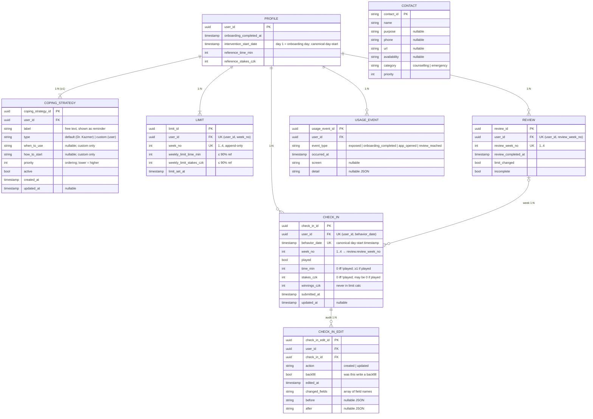

# Data Model

Single source of truth for the data layer. Diagrams: [`architecture.md`](architecture.md).
Field names verbatim from the brief — don't rename (export spec depends on them).

Stance: MVP on IndexedDB, one demo user; schema modelled server-ready
(normalized, `user_id` per user-owned row, integer money/time, UUID PKs — the
demo user's id is a generated `crypto.randomUUID()`, not a fixed literal).

## Entities

7 user-scoped tables, cardinality relative to their parent:

- `profile` — root (1)
- `coping_strategy (1:N, ≥1)` — per user, at least one selected at onboarding; `type` marks default (Dr. Kazmer) vs custom (user); exportable
- `limit (1:N)` — one per week, append-only
- `check_in (1:N)` — one per reported day; carries `week_no` linking it to its review week
- `review (1:N)` — one per closed week; groups its week's check-ins
- `usage_event (1:N)` — append-only interaction log (**required**)
- `check_in_edit (1:N)` — append-only audit trail, one row per check-in write; see [Edit audit trail](#edit-audit-trail)

Plus one **global reference** table (not per-user, no `user_id`):
- `contact` — help-line directory for the Kontakty tab; seeded from `content.md`, read-only in the app

### `intervention_start_date` — day 1

**Day 1 is the calendar day the user completes onboarding**, so
`intervention_start_date` is stamped from the completion instant's *local* date
(`completeOnboarding`, `src/domain/onboarding.ts`). The first check-in therefore
arrives the very next morning, and **day 1 is a partial day**.

This deviates from the brief's "first full calendar day after onboarding" —
deliberately, see [decisions.md](decisions.md). Every study day and week number
is derived from this one field by `createStudyCalendar` (`src/domain/clock.ts`);
nothing stores a day number.



`CONTACT` stands alone on purpose: it is global reference data with no `user_id`,
so it has no edge to `PROFILE` and survives a user-data drop.

Rendered copies (print): [`data-model.svg`](data-model.svg) · [`data-model.png`](data-model.png)

## Keys / constraints
- `check_in`: UNIQUE `(user_id, behavior_date)`
- `check_in.week_no` → `review.review_week_no` (per user) — links a day to its review week
- `limit`: UNIQUE `(user_id, week_no)`, append-only
- `review`: UNIQUE `(user_id, review_week_no)`
- `coping_strategy`: PK only (`type` distinguishes default vs custom)
- `usage_event`: no uniqueness (append-only)
- `check_in_edit`: no uniqueness (append-only); indexed by `user_id`, `check_in_id`, `edited_at`
- `contact`: PK only, global (no `user_id`)

Dexie `&[…]` compound index now → server `UNIQUE` later; same shape.

## Invariants
1. `!played` ⟹ `time_min = stakes_czk = winnings_czk = 0`
2. `played` ⟹ `time_min ≥ 1` (`stakes_czk`, `winnings_czk` may be 0)
3. ≤ 1 check-in per `(user_id, behavior_date)`
4. `weekly_limit_* ≤ 0.90 × reference_*`, every week
5. 1 `limit` per `(user_id, week_no)`; earlier rows never mutate
6. `winnings_czk` never enters a limit calc
7. no record ≠ a zero record (two distinct states)
8. ≥ 1 `coping_strategy` per user, enforced at onboarding (`completeOnboarding` rejects an empty list with `ONBOARDING_NO_COPING`). The brief asks for at least one; the app does not require two.
9. `intervention_start_date` and `behavior_date` are ISO 8601 timestamps with timezone, canonicalized to UTC midnight (`YYYY-MM-DDT00:00:00.000Z`) so each still represents one calendar day.

## Not stored — computed on read
Weekly used/totals, % vs limit, per-axis + overall status (worse of two),
remaining, `net_loss`, `is_backfill` (`date(submitted_at) > date(behavior_date) + 1d`),
missing-day set + `has_missing`, `usage_event` aggregates.
(`check_in.week_no` is a stored classifier for the review join, not an aggregate.)

`is_backfill` is the one of these that leaves the app: it is computed at export time
and written as a column in `check_in.csv`. It is still never stored.

## usage_event — designed, not yet recorded

> **Nothing writes a `usage_event` today.** The store, the `UsageEventAdapter` and the
> `UsageEventRepository` port all exist, and `createDataLayer()` wires the adapter up —
> but no service injects it and no code path calls it, so the table stays empty. The brief
> marks this log as **required**, so this is an open gap rather than a decision. The table
> below is the intended contract, kept so that wiring it up later is a matter of emitting
> rows, not of redesigning anything.

| event_type | should fire | feeds metric |
|---|---|---|
| `exposed` | first arrival to the app (once) | N exposed |
| `onboarding_completed` | user finishes onboarding (consent) | N consented |
| `app_opened` | every PWA open | N used > x times (count); N used > y weeks (span of `occurred_at`) |
| `review_reached` | reaches a review milestone; `detail.day ∈ {7,14,21,28}` | N "used" at pre-defined time points |

- Counts/spans would be derived from rows + `occurred_at` — nothing aggregated is stored.
- "Use" of the intervention = ≥ 1 `app_opened`; milestone engagement = `review_reached`.
- `exposed` may instead be derived as a user's first `app_opened`.

## Dexie stores
```txt
# v1
profile:         "user_id"
coping_strategy: "coping_strategy_id, user_id, type, priority"
limits:          "limit_id, &[user_id+week_no], user_id, week_no, limit_set_at"
check_ins:       "check_in_id, &[user_id+behavior_date], user_id, behavior_date, week_no, submitted_at, updated_at"
reviews:         "review_id, &[user_id+review_week_no], user_id, review_week_no, review_completed_at"
usage_events:    "usage_event_id, [user_id+occurred_at], user_id, event_type"
# v2
contacts:        "contact_id, category, priority"
# v3
check_in_edits:  "check_in_edit_id, user_id, check_in_id, edited_at"
# v4 — no new store; migrates intervention_start_date and behavior_date
#      from date-only strings to canonical UTC-midnight timestamps
```

`&` marks a unique index — it is what makes invariants 3–5 above fail the write
rather than merely being checked in code. `active`, `played` and `incomplete`
are stored fields but deliberately **not** indexed: every query that needs them
already narrows by `user_id` first and filters in memory.

## Rules
- Money/time = integers; % is float, display-time only, never persisted.
- Timestamps = ISO 8601 strings with timezone. Day-valued timestamp fields
  (`intervention_start_date`, `behavior_date`) are stored as canonical UTC
  midnight timestamps, not arbitrary instants.
- Units live in the field names (`*_min`, `*_czk`); the values are plain integers.
  There are no `Minutes` / `Czk` wrapper types — that was considered and not built.
- Normalized stores; wrap multi-row writes (week-close review) in one transaction.
- **Backfill window:** a still-missing day is fillable iff
  `1 ≤ studyDay(today) − studyDay(day) ≤ BACKFILL_WINDOW_DAYS` (5) **and** its week
  is not review-closed. Enforced once, in `canEditCheckIn` (`src/domain/guards.ts`);
  a refused write returns `CHECKIN_OUTSIDE_WINDOW` / `CHECKIN_WEEK_CLOSED`. Edits bump
  `updated_at`. Closed weeks: immutable. (`EDIT_WINDOW_DAYS` (7) still exists in
  `config.ts` but is currently unconsumed — the backfill window superseded it.)
- `coping_strategy`: one per-user table; `type` = `default` (Dr. Kazmer, seeded) or
  `custom` (user-written). ≥ 1 selected. Both editable/retireable and exportable.
- **Export: four raw tables** — `profile`, `check_in`, `limit`, `coping_strategy` —
  zipped, each a straight dump, **not** the person-day CSV of Příloha 2. A deliberate
  team decision, recorded in [decisions.md](decisions.md). The one derived column is
  `is_backfill` on `check_in`, computed at export time.
- Schema version = Dexie `db.version(n)`, currently **4**. The export carries no
  `schema_version` field today.
- Consistent time pickers across screens (UI concern, not data).
- `contact`: global reference data, seeded (`seeds/contacts.ts`) from the UX/UI
  content spec; `category` = `counselling` | `emergency`. Not per-user; the app
  never records whether a user contacted a service.

## Edit audit trail

`check_in_edit` is **built and wired**: `CheckInServiceImpl` appends one row on every
check-in write (`action: 'created' | 'updated'`), carrying `backfill`, `changed_fields`
and JSON `before`/`after` snapshots. It is append-only — rows are never updated or
deleted, so the trail stays a record of what happened rather than a mirror of current
state.

It is deliberately **not** part of the CSV export: the export ships the four raw tables
only, and backfill reaches the researchers through `check_in.is_backfill` instead.

## Open
- **`usage_event` is not emitted at all** — see the section above. The only gap here that
  the brief calls required.
- Reference week editable after onboarding? Default no.
- Demo-drawer actions in `usage_event`: don't-log vs `origin` tag (moot until events are
  emitted at all).

Resolved: **default coping content is in.** `src/data/seeds/copingDefaults.ts` carries six
catalog strategies with the full detail copy (`title`, `what_to_do`, `why_it_can_help`,
`how_to`, `when_useful`, notes, restriction options), transcribed from
`tasks/coping-strategie/content.md` and rendered by `CatalogStrategyDetailScreen`. It is
still marked PROVISIONAL pending NUDZ sign-off on the wording, but nothing is blocked.

Resolved since this doc was written: demo clock persistence uses **localStorage**
(`src/ui/admin/adminStore.ts`), not an `app_meta` table — the time machine is a UI
concern and nothing in `src/data` knows it exists.

## Future extensions (README)
- Edit already-submitted results (fuller edit UX beyond the backfill window).
- Surface the edit history to the user or to the export — the data is already being
  collected, nothing reads it back yet.
