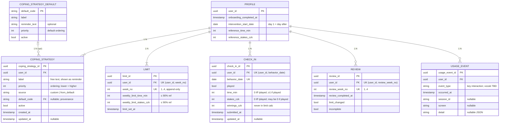

# Data Model

Single source of truth for the data layer. Diagrams: [`../../../docs/architecture.md`](../../../docs/architecture.md).
Field names verbatim from the brief — don't rename (export spec depends on them).

Stance: MVP on IndexedDB, one demo user `A001`; schema modelled server-ready
(normalized, `user_id` per user-owned row, integer money/time, UUID PKs).

## Entities

7 tables, cardinality relative to their parent:

- `profile` — root (1)
- `coping_strategy (1:N)` — user-owned, free text or adopted; has `priority`; exportable; source of truth for the reminder
- `coping_strategy_default (1:N, opt)` — seed-only suggestion list, no `user_id`
- `limit (1:N)` — one per week, append-only
- `check_in (1:N)` — one per reported day
- `review (1:N)` — one per closed week
- `usage_event (1:N)` — append-only interaction log (**required**; key events TBD)



## Keys / constraints
- `check_in`: UNIQUE `(user_id, behavior_date)`
- `limit`: UNIQUE `(user_id, week_no)`, append-only
- `review`: UNIQUE `(user_id, review_week_no)`
- `coping_strategy_default`: UNIQUE `default_code`
- `coping_strategy.default_code`: nullable FK → default (null = custom)
- `usage_event`: no uniqueness (append-only)

Dexie `&[…]` compound index now → server `UNIQUE` later; same shape.

## Invariants
1. `!played` ⟹ `time_min = stakes_czk = winnings_czk = 0`
2. `played` ⟹ `time_min ≥ 1` (`stakes_czk`, `winnings_czk` may be 0)
3. ≤ 1 check-in per `(user_id, behavior_date)`
4. `weekly_limit_* ≤ 0.90 × reference_*`, every week
5. 1 `limit` per `(user_id, week_no)`; earlier rows never mutate
6. `winnings_czk` never enters a limit calc
7. no record ≠ a zero record (two distinct states)

## Not stored — computed on read
Weekly used/totals, % vs limit, per-axis + overall status (worse of two),
remaining, `net_loss`, `is_backfill` (`date(submitted_at) > behavior_date + 1d`),
missing-day set + `has_missing`, `usage_event` aggregates.

## Dexie stores
```txt
profile:                 "user_id"
coping_strategy:         "coping_strategy_id, user_id, source, default_code, active, priority"
coping_strategy_default: "default_code, active, priority"
limits:                  "limit_id, [user_id+week_no], user_id, week_no, limit_set_at"
check_ins:               "check_in_id, [user_id+behavior_date], user_id, behavior_date, submitted_at, updated_at, played"
reviews:                 "review_id, [user_id+review_week_no], user_id, review_week_no, review_completed_at, incomplete"
usage_events:            "usage_event_id, [user_id+occurred_at], user_id, event_type, session_id"
```

## Rules
- Money/time = integers; % is float, display-time only, never persisted.
- Value objects `Minutes` / `Czk`.
- Normalized stores; wrap multi-row writes (week-close review) in one transaction.
- Editing allowed only within `EDIT_WINDOW_DAYS` (X, float) of the day; the user
  always sees the deadline. Edits bump `updated_at`. Closed weeks: immutable.
- Export: person-day CSV (Příloha 2) **plus** coping strategies (incl. custom).
- Schema version = Dexie `db.version(n)`; export envelope carries `schema_version`.
- Consistent time pickers across screens (UI concern, not data).

## Open
- `EDIT_WINDOW_DAYS` value (X) — TBD.
- `usage_event` key-interaction vocab — TBD (BE+FE+UX).
- Default suggestion content pending Ladislav (app not blocked — users add their own).
- Reference week editable after onboarding? Default no.
- Demo clock persistence: `app_meta` vs localStorage (`demo_day_offset` must survive refresh).
- Demo-drawer actions in `usage_event`: don't-log vs `origin` tag.

## Future extensions (README)
- Edit already-submitted results (fuller edit UX beyond in-window fill).
- Track retroactive edits: append-only `check_in_edit` log —
  `check_in_edit_id`, `user_id`, `check_in_id`, `action (created|updated)`,
  `edited_at`, `changed_fields`, `before`/`after` (JSON). Designed, not built.
